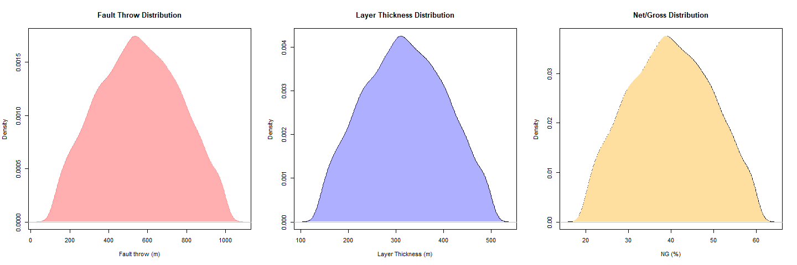
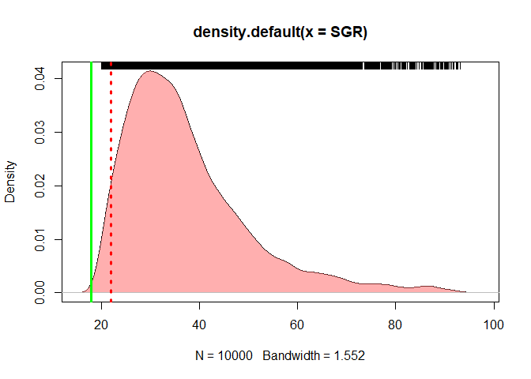
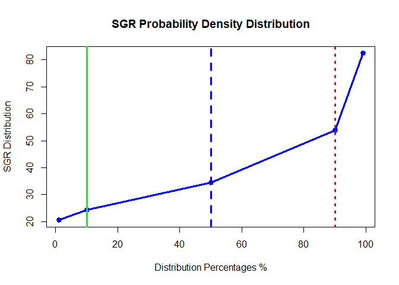
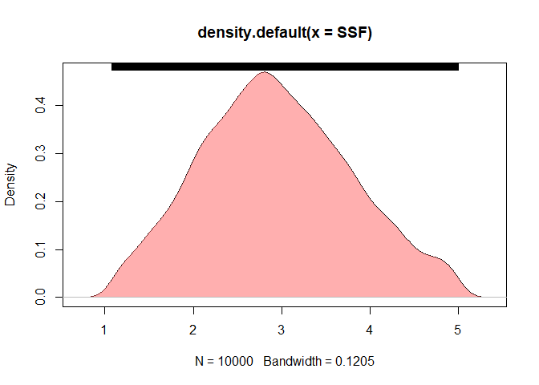
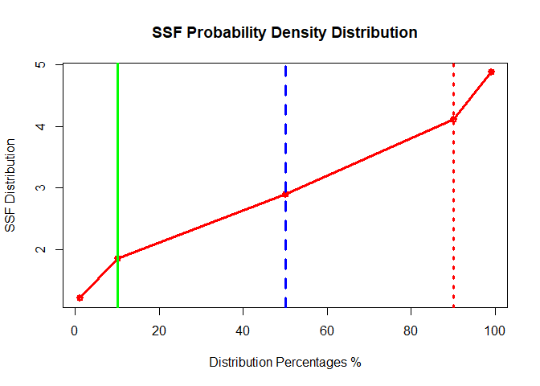

# R Fault Seal Analysis Usong R  _"FSAR"_

The most two famous and common processes to determine the fault seal analysis are Shale Gouge Ratio **"SGR"** and Shale Smear Factor **"SSF"**.

## Data Input


```r
library(mc2d)

### Inputs
  
  Ftp90 <- 120    ### Meters ### FAULT THROW MINIMUM VALUE
  Ftp10 <- 1000   ### Meters ### FAULT THROW MAXIMUM VALUE
  
  Ltp90 <- 140    ### Meters ### LAYER THICKNESS MINIMUM VALUE
  Ltp10 <- 500    ### Meters ### LAYER THICKNESS MAXIMUM VALUE
  
  Ngp90 <- 20     ### %      ### NET OVER GROSS MINIMUM VALUE
  Ngp10 <- 60     ### %      ### NET OVER GROSS MAXIMUM VALUE
```

## Data Processing (Creating Monte Carlo Model)

```r
  n = 10000     ### NUMBER OF ITERATIONS
  seed = 999    ### SEED 
  
  ### Calculate the SD 
  Ftsd <- sd(Ftp90:Ftp10)
  Ltsd <- sd(Ltp90:Ltp10)
  ngsd <- sd(Ngp90:Ngp10)
  
  ### Calculate the Mean 
  
  Ftmean <- mean(Ftp90:Ftp10)
  Ltmean <- mean(Ltp90:Ltp10)
  ngmean <- mean(Ngp90:Ngp10)

  ### Fault throw Distribution
  Ft = mcstoc(rnorm, mean=Ftmean, sd=Ftsd, rtrunc=TRUE, linf=Ftp90, lsup=Ftp10, seed = seed, nsv= n )

  ### Layer thickness Distribution
  Lt = mcstoc(rnorm, mean=Ltmean, sd=Ltsd, rtrunc=TRUE, linf=Ltp90, lsup=Ltp10, seed = seed, nsv= n )
  
  ### NG Distribution
    NG = mcstoc(rnorm, mean=ngmean, sd=ngsd, rtrunc=TRUE, linf=Ngp90, lsup=Ngp10, seed = seed, nsv= n)
  par(mfrow=c(1,3))
  # 
  # hist(Ft, xlab="Fault throw (m)", breaks=100, col="cyan", border = NA)
  # hist(Lt, xlab="Layer Thickness (m)", breaks=100, col="red", border = NA)
  # hist(NG, xlab="NG (%)", breaks=100, col="yellow", border = NA)
  
  DENFT <- density(Ft) 
  DENLT <- density(Lt)
  DENNG <- density(NG)
  plot(DENFT, col="#ff606080", border=NA,xlab="Fault throw (m)",main = "Fault Throw Distribution") 
  polygon(DENFT, col="#ff606080", border=NA)
  plot(DENLT, xlab="Layer Thickness (m)",main = "Layer Thickness Distribution")
  polygon(DENLT, col="#6060ff80", border=NA)
  plot(DENNG, xlab="NG (%)",main = "Net/Gross Distribution")
  polygon(DENNG, col="#FFDF9F", border=NA)
```



## Results and Outputs
### Shale Gouge Ratio Claculation


```r
  SGR = (((100-NG)*Lt/Ft))
  
   ### Historgam plot for SGR
   hist(SGR, xlab="SGR (%)", breaks=100, col="seagreen1")
```


```r
   ### density plot for SGR
   DENSGR <- density(SGR)
   plot(DENSGR) 
        polygon(DENSGR, col="#ff606080", border=NA)
        rug(SGR, side = 3)
        abline(v=c(18,22),lwd = 3,col = c("green","red") , lty =c(1,3))
```



```r
   P<-summary(SGR, probs = c(0.01,0.1,0.50,0.9,0.99))
   
   Pdata<- data.frame(unmc(P))
        colnames(Pdata)<- c("Mean","SD","1%","10%","50%","90%","99%")
        rownames(Pdata)[1] <- "SGR"
        
        SGRdata <- as.data.frame(Pdata[3:7])
   
   knitr::kable(Pdata[,1:7], digits = 0,  caption = "SGR MC Distribution ",booktabs = TRUE)
```


Table: SGR MC Distribution 

       Mean   SD   1%   10%   50%   90%   99%
----  -----  ---  ---  ----  ----  ----  ----
SGR      37   13   21    24    34    54    82

```r
   plot(x=c(1,10,50,90,99), y=Pdata[3:7], type="o",lwd = 3,
            col="blue", main = "SGR Probability Density Distribution",
           xlab = "Distribution Percentages %",
           ylab = "SGR Distribution")
            abline(v=c(10,50,90),lwd = 3,col = c("green","blue","red") , lty =c(1,2,3))
```



### Shale Smear Factor Claculation

```r
  SSF = (Ft/((100-NG)*Lt))*100

    ### Histogram plot for SSF
  hist(SSF, xlab="SSF (%)", breaks=100, col="orange")
```


```r
    ### density plot for SSF
   DENSSF <- density(SSF)
   plot(DENSSF) 
        polygon(DENSSF, col="#ff606080", border=NA)
        rug(SSF, side = 3)
```



```r
  SSFP<-summary(SSF, probs = c(0.01,0.1,0.50,0.9,0.99))
  PSSFdata<- data.frame(unmc(SSFP), drop= TRUE)
  
  colnames(PSSFdata)<- c("Mean","SD","1%","10%","50%","90%","99%")
  rownames(PSSFdata)[1] <- "SSF"
     SSFy5 = list(PSSFdata[3:7])
    
     knitr::kable(PSSFdata[,1:7], digits = 0,  caption = "SSF MC Distribution ",booktabs = TRUE)
```


Table: SSF MC Distribution 

       Mean   SD   1%   10%   50%   90%   99%
----  -----  ---  ---  ----  ----  ----  ----
SSF       3    1    1     2     3     4     5

```r
   plot(x=c(1,10,50,90,99), y=PSSFdata[3:7], type = "o",col="red",lwd = 3, main = "SSF Probability Density Distribution",
           xlab = "Distribution Percentages %",
           ylab = "SSF Distribution") 
            abline(v=c(10,50,90),lwd = 3,col = c("green","blue","red") , lty =c(1,2,3))
```



## References 

 - <https://wiki.aapg.org/Shale_smear_factor>  
 - <https://wiki.aapg.org/Quantitative_fault_seal_analysis>  
 
 
